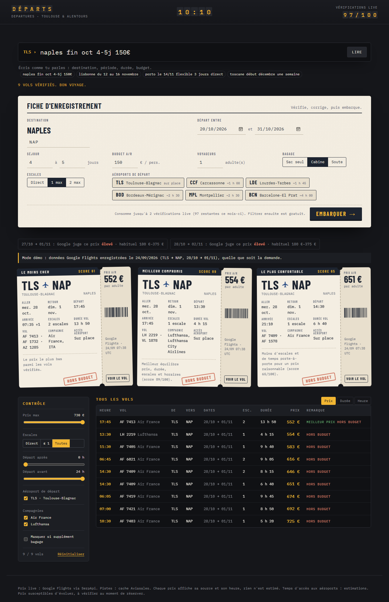

# Départs — un agent perso qui trouve les meilleurs vols

Tape `naples fin oct 4-5j 150€` : l'app lit ta demande, interroge Google Flights sur **six aéroports autour de Toulouse à la fois**, et imprime le top 3 sous forme de cartes d'embarquement. Le moins cher, le meilleur compromis, le plus confortable.



Premier vrai test : Toulouse → Naples fin octobre, le meilleur prix depuis Toulouse était **552 €**. En élargissant aux aéroports proches, l'app a trouvé **155 € A/R en direct depuis Barcelone**.

## Ce qui la rend différente

- **Zéro prix inventé.** L'IA n'est pas dans la boucle des chiffres : les prix viennent de Google Flights (via SerpApi), le classement est du code déterministe testé, et chaque prix affiche sa source et son heure. Les réponses brutes sont journalisées pour pouvoir tout retracer.
- **Multi-aéroports pour le prix d'une recherche.** Un seul appel couvre TLS, Carcassonne, Lourdes, Bordeaux, Montpellier et Barcelone. Le score tient compte du temps pour rejoindre chaque aéroport.
- **Quota maîtrisé.** Le plan gratuit SerpApi donne 250 recherches par mois, et l'app affiche le solde réel lu chez SerpApi. Une recherche en consomme au plus 2, et les filtres (prix, escales, horaires, compagnies, aéroports) ne coûtent rien : ils trient les résultats déjà reçus.
- **N'importe quelle destination du monde.** Tape une ville, un pays, un aéroport ou un code (Cancún, Bali, Tokyo, KEF) : la fiche propose les correspondances avec leurs aéroports, fautes de frappe comprises (« tokio » → Tokyo). Recherche gratuite, sans quota.
- **Barre de commande en français, sans IA.** Un parseur déterministe comprend « fin oct », « du 12 au 16 novembre », « 4-5j », « 150€ », « direct », « valise en soute », « toscane » (Pise + Florence)…
- **Honnête sur les bagages.** L'app ne devine aucun tarif : elle affiche ce que Google indique et prévient quand un supplément est probable (low-cost, soute non incluse).

## Lancer l'app

Prérequis : Python 3.11+ sous Windows (macOS/Linux : mêmes commandes avec `.venv/bin/python`).

```bash
git clone https://github.com/Deady31/Travel-Agent.git
cd Travel-Agent
```

**Sans clé, en mode démo** (rejoue une recherche enregistrée) : double-clic sur `start.bat`, ou :

```bash
python -m venv .venv
.venv\Scripts\python.exe -m pip install -r requirements-dev.txt
.venv\Scripts\python.exe run.py --demo
```

**Avec de vraies recherches** : copie `.env.example` en `.env`, ajoute ta clé [SerpApi](https://serpapi.com) (gratuite, 250 recherches/mois) et, en option, ton token [Travelpayouts](https://www.travelpayouts.com) (gratuit, aide à choisir les dates). Puis `start.bat` ou `run.py`. L'app s'ouvre sur `http://127.0.0.1:8765` et n'écoute que ta machine.

Astuce : une recherche se partage par lien, `http://127.0.0.1:8765/?q=lisbonne+du+12+au+16+novembre&go=1`.

## Comment ça marche

```
« naples fin oct 4-5j 150€ »
        │  parser.py (règles, pas d'IA)
        ▼
fiche : NAP · 20→31/10 · 4-5 j · 150 € · cabine
        │  search.py
        ├─► Travelpayouts (cache gratuit) : quelles dates semblent les moins chères ?
        ├─► choix de 2 couples de dates (cache, sinon mardi/mercredi au milieu de la période)
        └─► SerpApi Google Flights × 2, les 6 aéroports d'un coup
        │
        ▼  scoring.py
prix · durée porte-à-porte · escales · horaires  →  top 3
        │
        ▼  webapp/ (FastAPI + JS sans framework)
cartes d'embarquement + tableau des départs + filtres gratuits
```

Score par défaut : prix 50 %, durée porte-à-porte 22 %, escales 17 %, horaires 11 % (départ avant 6 h ou arrivée après 23 h 30 pénalisés). Détails et arbitrages : [PLAN.md](PLAN.md).

## L'utiliser sur ton téléphone (Vercel, privé)

L'app se déploie telle quelle sur Vercel (plan gratuit) : le serveur ne garde aucun état, le quota est lu chez SerpApi, et **tout est protégé par un mot de passe**.

1. Sur [vercel.com/new](https://vercel.com/new), importe ce dépôt GitHub.
2. Dans *Environment Variables*, ajoute `SERPAPI_KEY`, `TRAVELPAYOUTS_TOKEN` (facultatif) et `APP_PASSWORD` (une longue phrase de passe).
3. *Deploy*. Ouvre l'URL, passe le contrôle d'embarquement, puis :
   - iPhone : Safari → Partager → *Sur l'écran d'accueil* ;
   - Android / PC : Chrome ou Edge → *Installer l'application*.

Sans `APP_PASSWORD` (12 caractères minimum), la version en ligne refuse de s'afficher : impossible de la laisser ouverte par erreur. Les sessions durent 30 jours ; ajouter ou changer `SESSION_SECRET` (chaîne aléatoire, facultative) déconnecte tous les appareils. En local, pas de mot de passe (sauf si tu en définis un dans `.env`).

## Aussi utilisable depuis Claude

`server.py` expose les mêmes outils en serveur **MCP** (`search_live_flights`, `rank_flights`, `get_quota`). Ouvre le dossier dans Claude Code : `.mcp.json` le déclare, et `CLAUDE.md` impose les règles (jamais de prix sans source, une seule question de clarification, 2 recherches max).

## Structure

```
agent_vols/          moteur (sans interface)
  parser.py          commande en français -> demande structurée
  airports.py        villes -> codes IATA, temps d'accès depuis Toulouse
  places.py          recherche mondiale de destinations (autocomplétion Travelpayouts, repli local)
  search.py          orchestration cache -> live, quota, enrichissement
  scoring.py         score déterministe et top 3
  serpapi_provider.py / travelpayouts_provider.py / bags.py / quota.py
webapp/              app web (FastAPI + HTML/CSS/JS), locale ou sur Vercel, installable
server.py            serveur MCP pour Claude
tests/               101 tests hors ligne (fixtures réelles, aucun quota consommé)
```

## Tests

```bash
.venv\Scripts\python.exe -m pytest --cov=agent_vols --cov=webapp
```

## Limites connues

- Horaires affichés pour le vol aller (le prix, lui, est bien le total aller-retour).
- Le lien ouvre la recherche Google Flights correspondante, pas l'offre exacte : repère-la grâce aux numéros de vol.
- Temps d'accès aux aéroports : estimations à ajuster dans `agent_vols/data/airports.json`.
- Le cache Travelpayouts est vide sur beaucoup de petites lignes. L'app choisit alors les dates par heuristique.

## Feuille de route

- [x] MVP : recherche live, score, top 3, serveur MCP
- [x] V1 : 6 aéroports, dates flexibles, infos bagages, app web, destinations mondiales, version mobile privée
- [ ] V2 : alertes de prix quotidiennes sur Telegram, mémoire des préférences

## Données et conditions d'utilisation

Prix live : Google Flights via [SerpApi](https://serpapi.com). Pistes de dates : [Aviasales Data API](https://support.travelpayouts.com/hc/en-us/articles/203956163-Aviasales-Data-API). Aucun scraping direct de compagnie aérienne. Projet personnel, sans lien avec Google, SerpApi ou Aviasales. Les prix évoluent : vérifie toujours au moment de réserver.

## Licence

MIT
